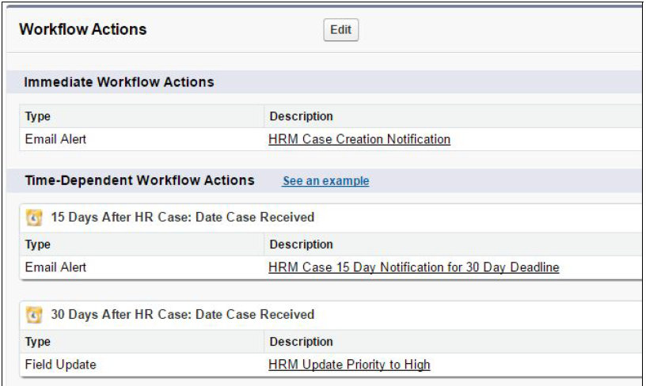

# Installation and Configuration

Configuring the HRM Case Management Package:

1. Create the following Public Groups:

   | Label                   | Group Name              | Grant Access Using Hierarchy |
   | ----------------------- | ----------------------- | ---------------------------- |
   | HRMROOUsers             | HRM_ROO_Users           | True                         |
   | HRM–C Office–Managers   | HRM_C_Office_Managers   | True                         |
   | HRM–CH Office–Managers  | HRM_CH_Office_Managers  | True                         |
   | HRM–CHS Office–Managers | HRM_CHS_Office_Managers | True                         |
   | HRM–CHT Office–Managers | HRM_CHT_Office_Managers | True                         |
   | HRM–CHW Office–Managers | HRM_CHW_Office_Managers | True                         |
   | HRM–CP Office–Managers  | HRM_CP_Office_Managers  | True                         |
   | HRM–CPB Office–Managers | HRM_CPB_Office_Managers | True                         |
   | HRM–CPD Office–Managers | HRM_CPD_Office_Managers | True                         |
   | HRM–CPE Office–Managers | HRM_CPE_Office_Managers | True                         |
   | HRM–CPF Office–Managers | HRM_CPF_Office_Managers | True                         |
   | HRM–CPG Office–Managers | HRM_CPG_Office_Managers | True                         |
   | HRM–CPH Office–Managers | HRM_CPH_Office_Managers | True                         |
   | HRM–CPI Office–Managers | HRM_CPI_Office_Managers | True                         |
   | HRM–CPJ Office–Managers | HRM_CPJ_Office_Managers | True                         |
   | HRM–CPK Office–Managers | HRM_CPK_Office_Managers | True                         |
   | HRM–CPL Office–Managers | HRM_CPL_Office_Managers | True                         |
   | HRM–CPM Office–Managers | HRM_CPM_Office_Managers | True                         |
   | HRM–CPW Office–Managers | HRM_CPW_Office_Managers | True                         |
   | HRM–RAS–Users           | HRM_RAS_Users           | True                         |
   | HRM–Superusers          | HRM_Superusers          | True                         |
   | HRM–Users               | HRM_Users               | True                         |

1. Create Queue with the following properties:
1. Update the URL for following button in the ‘ HR Case ’ Object with the formula below,
   replace the variable names with the Id of the variable. Variable names are surrounded in square brackets "[]"

### New Disciplinary Case

```apex
/{!$ObjectType.HR_Case__c}/e?CF [Parent_HR_Case_No__c] ={!HR_Case__c.Name}& [HRM_OIG_Case_Number__c] ={!HR_Case__c.HRM_OIG_Case_Number__c}& [HRM_Office__c] ={!HR_Case__c.HRM_Office__c}&CF [HRM_Named_Employee__c] ={!HR_Case__c.HRM_Named_Employee__c}& [HRM_Position_Title__c] ={!HR_Case__c.HRM_Position_Title__c}& [HRM_Position_Grade__c] ={!HR_Case__c.HRM_Position_Grade__c}& [HRM_Pay_Plan__c] ={!HR_Case__c.HRM_Pay_Plan__c}& [HRM_Position_Series__c] ={!HR_Case__c.HRM_Position_Series__c}& [HRM_Is_the_Employee_a_Supervisor__c] ={!HR_Case__c.HRM_Is_the_Employee_a_Supervisor__c}&retURL=%2Fa2b%2Fo&RecordType= [Disciplinary Case] &ent= [HR_Case__c]
```

### New Grievance Case

```apex
/{!$ObjectType.HR_Case__c}/e?CF [Parent_HR_Case_No__c] ={!HR_Case__c.Name}& [HRM_OIG_Case_Number__c] ={!HR_Case__c.HRM_OIG_Case_Number__c}& [HRM_Office__c] ={!HR_Case__c.HRM_Office__c}&CF [HRM_Named_Employee__c] ={!HR_Case__c.HRM_Named_Employee__c}& [HRM_Position_Title__c] ={!HR_Case__c.HRM_Position_Title__c}& [HRM_Position_Grade__c] ={!HR_Case__c.HRM_Position_Grade__c}& [HRM_Pay_Plan__c] ={!HR_Case__c.HRM_Pay_Plan__c}& [HRM_Position_Series__c] ={!HR_Case__c.HRM_Position_Series__c}& [HRM_Is_the_Employee_a_Supervisor__c] ={!HR_Case__c.HRM_Is_the_Employee_a_Supervisor__c}&retURL=%2Fa2b%2Fo&RecordType= [Grievances and Arbitration Case] &ent= [HR_Case__c]
```

### New Performance Case

```apex
/{!$ObjectType.HR_Case__c}/e?CF [Parent_HR_Case_No__c] ={!HR_Case__c.Name}& [HRM_OIG_Case_Number__c] ={!HR_Case__c.HRM_OIG_Case_Number__c}& [HRM_Office__c] ={!HR_Case__c.HRM_Office__c}&CF [HRM_Named_Employee__c] ={!HR_Case__c.HRM_Named_Employee__c}& [HRM_Position_Title__c] =!HR_Case__c.HRM_Position_Title__c}& [HRM_Position_Grade__c] ={!HR_Case__c.HRM_Position_Grade__c}& [HRM_Pay_Plan__c] ={!HR_Case__c.HRM_Pay_Plan__c}& [HRM_Position_Series__c] ={!HR_Case__c.HRM_Position_Series__c}& [HRM_Is_the_Employee_a_Supervisor__c] ={!HR_Case__c.HRM_Is_the_Employee_a_Supervisor__c}&retURL=%2Fa2b%2Fo&RecordType= [HRM_Performance_Case] &ent= [HR_Case__c]
```

1. Update the Permission set to add Record types permissions for object HR Cases:

| Record Type                         | HRM-AS-CRE | HRM-RAS-CRE | HRM-ROO/AO-CRE | HRMSuperuserCRE |
| ----------------------------------- | ---------- | ----------- | -------------- | --------------- |
| Disciplinary Case                   | Yes        | Yes         | Yes            | Yes             |
| Grievances and Arbitration Case     | Yes        | Yes         | Yes            | Yes             |
| Medical Case                        | Yes        | Yes         | Yes            | Yes             |
| OIG Case                            | Yes        | Yes         | Yes            | Yes             |
| Performance Case                    | Yes        | Yes         | Yes            | Yes             |
| Reasonable Accommodation (RA) Case) | No         | Yes         | No             | No              |

1. Update the following workflows to add time triggers and move Email Alerts and Field. Updates from Immediate Action to the Time Triggers.

### HRM 10 and 15 Day Action Based on Date Case Received


### HRM 15 and 30 Day Action Based on Date Case Received



### HRM 15 and 30 Day Action Based on Date MGMT & HR Agree to Decided Action


### HRM 15 and 30 Day Action Based on Date MGMT & HR Agree to Proposed Action


### HRM 15, 45 and 60 Day Notification Based on Date MGMT & HR Agree to Proposed Action


### HRM OIG 30 and 60 Day Action Based on Date Case Recieved


